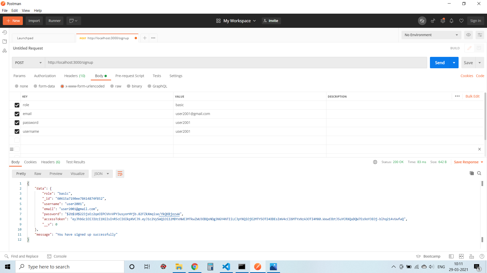
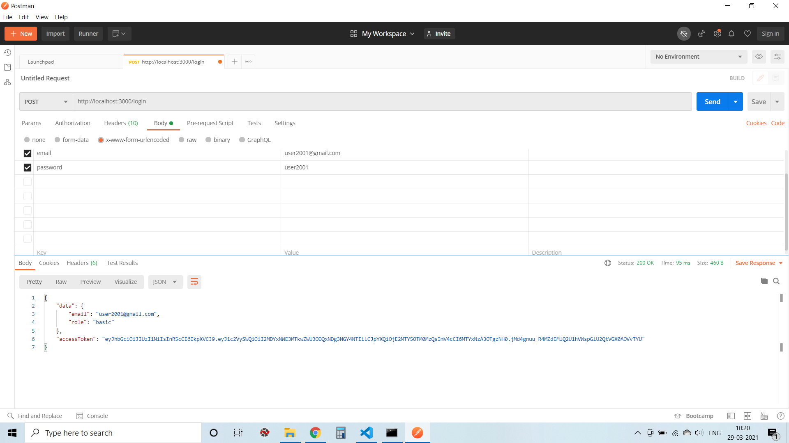
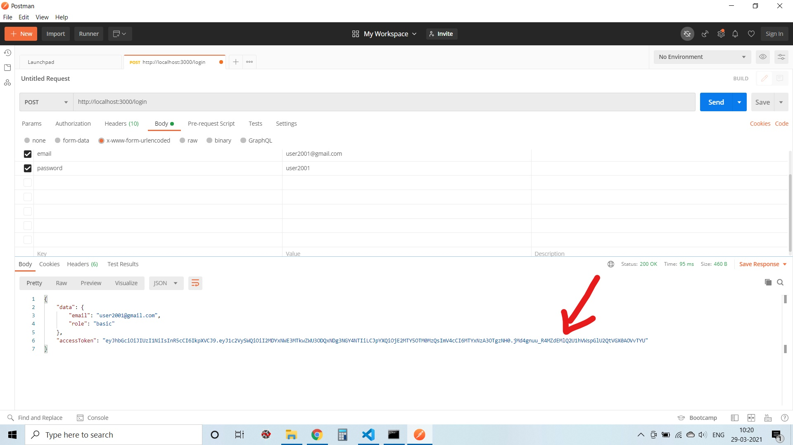
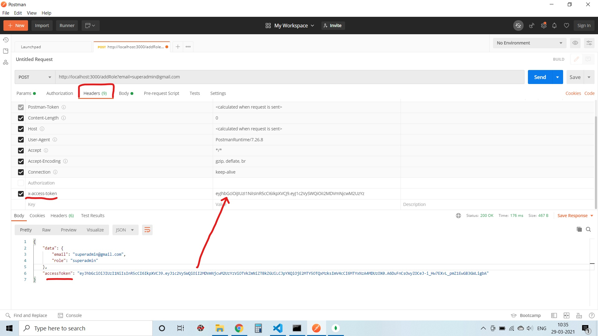
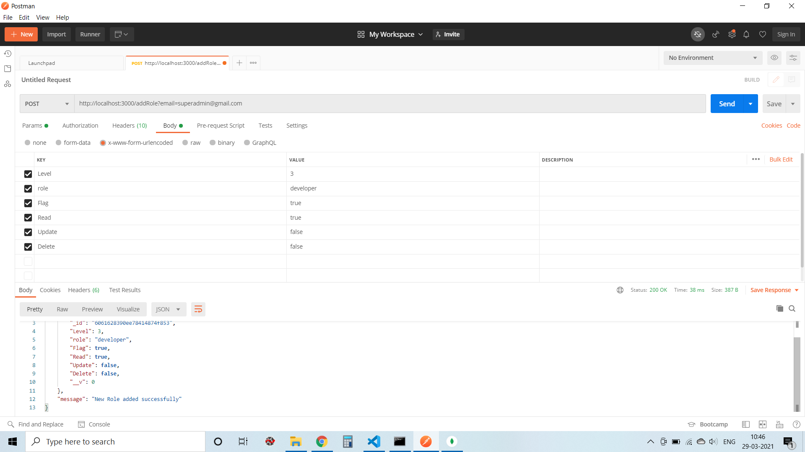
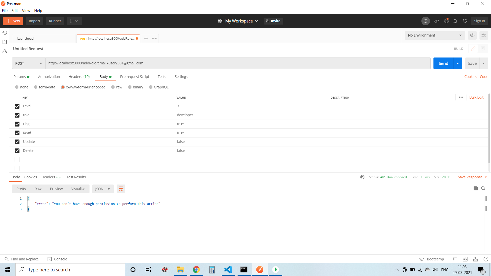
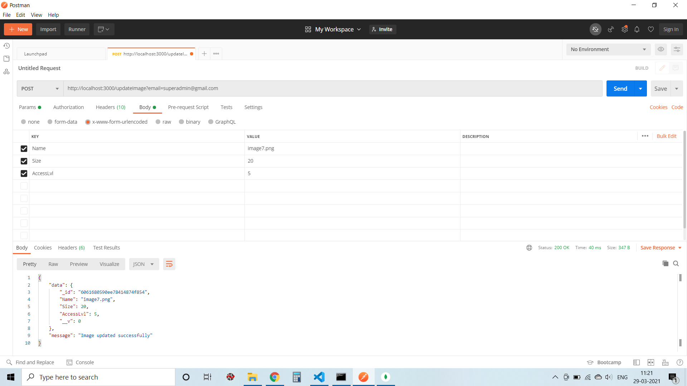
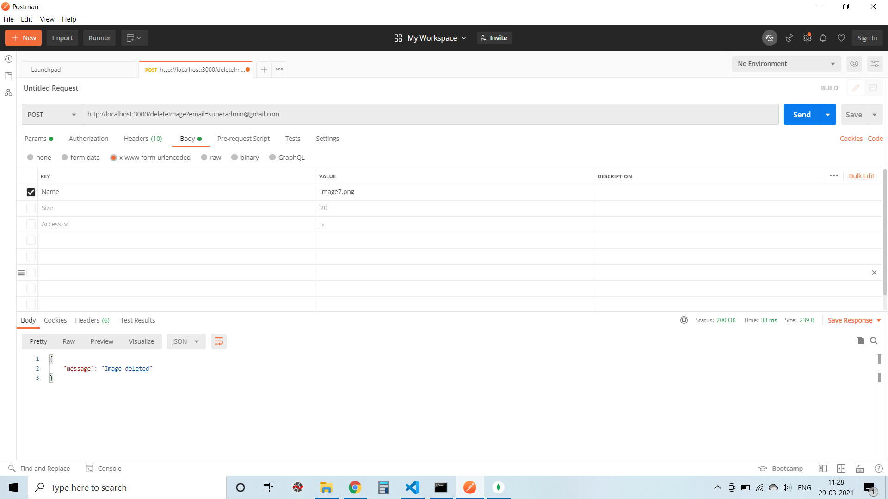
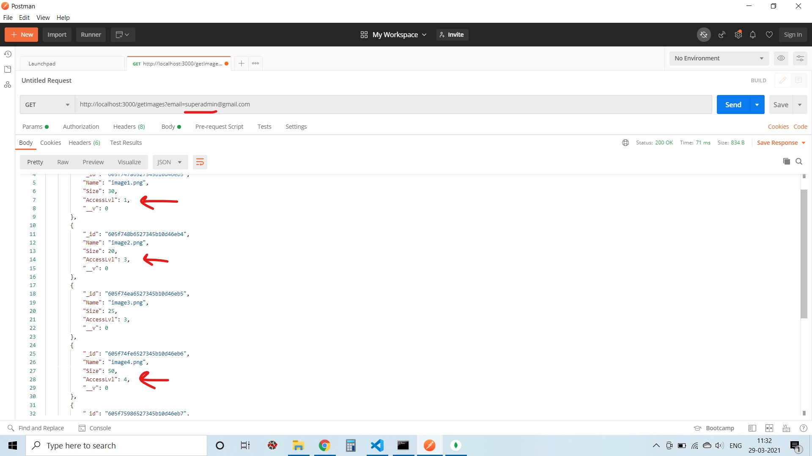
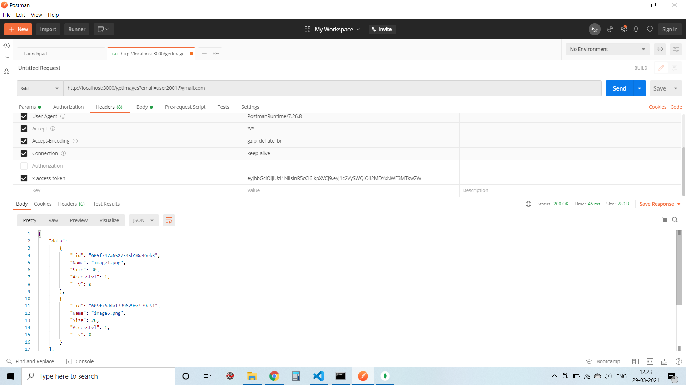

# Simple API for RBAC 
This is an API implementing the RBAC model which has been developed and tested using the <a href = "https://www.postman.com/" alt = "PostMan">PostMan</a> application.
This was built using Express and MongoDB.

## Description 
server/control/controls.js -> This file consists of all the methods which are used to signup, login and query the mongoDB database. 
server/models/dbModel.js -> This file defines the structure of the database which has three collections: users, roles and images. 
server/routes/route.js -> This file consists of all the routes (urls) to help the user navigate through the application. 
server/server.js -> This file sets up connection with the database and checks if the jwt token is expired. If the jwt token is expired, then the user has to login again. 

## Setup
To run this application locally, follow the steps given below:
1. Clone this repository: Open your command prompt and type: <code>git clone https://github.com/siddhanth339/RBAC.git</code>
2. Npm install: Next, run the <code> npm install </code> command, which will install all the dependencies listed in the package.json file.
3. Npm start: Finally, run the <code> npm start </code> command, this command will start the application.

## Using the API
Open PostMan. 

## SignUp

1. Set the method to "POST"
2. Set URL: <code>http://localhost:3000/signup</code>
3. Inside the Body section, provide details for signup: "role", "email", "password", "username".
Note that the "role" can take only one of these values (["basic", "supervisor", "developer", "admin", "superadmin"])

## Login

1. Set the method to "POST"
2. Set URL: <code>http://localhost:3000/login</code>
3. Inside the Body section, provide login details: "email" and "password"

<b>Note:</b> The below features can be used only after user logs in (authentication).

## Add Roles
For now, a user can be assigned with only one of these roles (["basic", "supervisor", "developer", "admin", "superadmin"]). 
To add a role to the roles collection, we have to first login as a "superadmin". So, create a user having role set to "superadmin". 
After login, copy the accessToken returned by the API which can be found at the bottom as shown in the figure below, the accessToken is used to authenticate the user.
 

1. Set the method to "POST"
2. Set URL: <code>http://localhost:3000/addRole?email=superadmin@gmail.com</code> (the email of superadmin)
3. Set the "x-access-token" attribute in the Headers section to the accessToken value as shown in the figure below.

4. Also provide details of the role: "Level", "role", "Flag", "Read", "Update", "Delete".  
"Level": The access level of the user. 
"role": Role of the user. 
"Flag": Boolean, when set to true, only the images having access level equal to the level of the user will be displayed. If it is set to false then all the images having access level less than or equal to the access level of the user will be displayed. 
Example, "developer" role has "Level" set to 3 and "Flag" set to true, this means that the "developer" will be shown images having access level = 3 only. 
On the other hand, if the user has role as "superadmin" with "Level" set to 5 and "Flag" set to false, the "superadmin" will be able to see all the images having access level <= 5. 

If the user is not a superadmin, he/she will not be allowed to add roles to the database (RBAC in use) 
As shown below, user2001 was unable to access the database and add roles. 

## Add images
Images can only be added by admin and superadmin. It is similar to adding role  
1. Set the method to "POST"
2. Set URL: <code>http://localhost:3000/addImage?email=superadmin@gmail.com</code> (the email of superadmin)
3. Set the "x-access-token" attribute in the Headers section

4. Also provide details of the image: "Name", "Size", "AccessLvl" 
"Name": Name of the image file. 
"Size": Size of the image. 
"AccessLvl": Who can access this image. For example, if AccessLvl = 4 then, users having Level greater than or equal to 4 can only access this image i.e., if Level of "admin" is 4, then only "admin" and "superadmin" can access this image.  

## Update Image
Users having the privilege to update images can only update the images. This privilege is set by the "superadmin" at the time of creating roles by setting the "Update" column value to "true".
1. Set the method to "POST"
2. Set URL: <code>http://localhost:3000/updateImage?email=superadmin@gmail.com</code> (the email of superadmin)
3. Set the "x-access-token" attribute in the Headers section
4. Provide details to update the image in the Body section: "Name", "Size", "AccessLvl" 
For example, update the AccessLvl of "image7.png" from AccessLvl = 4 to AccessLvl = 5. 

## Delete Image
Users having the privilege to delete images can only delete the images. This privilege is set by the "superadmin" at the time of creating roles by setting the "Delete" column value to "true".
1. Set the method to "POST"
2. Set URL: <code>http://localhost:3000/deleteImage?email=superadmin@gmail.com</code> (the email of superadmin)
3. Set the "x-access-token" attribute in the Headers section
4. Provide details to delete the image in the Body section: "Name"  

## Access Images
Users access images based on their access level (RBAC in use). 
1. Set the method to "GET"
2. Set URL: <code>http://localhost:3000/getImages?email=superadmin@gmail.com</code> (the email of superadmin)
3. Set the "x-access-token" attribute in the Headers section
4. No values have to be provided in the Body section, the application gets the user's email from the url, checks the level of the user and displays appropriate images. 

Example: When the superadmin logs in and then tries to get the images, all images having access level <= 5 are shown  

When a "basic" user logs in, he/she is shown all images having access level = 1.

